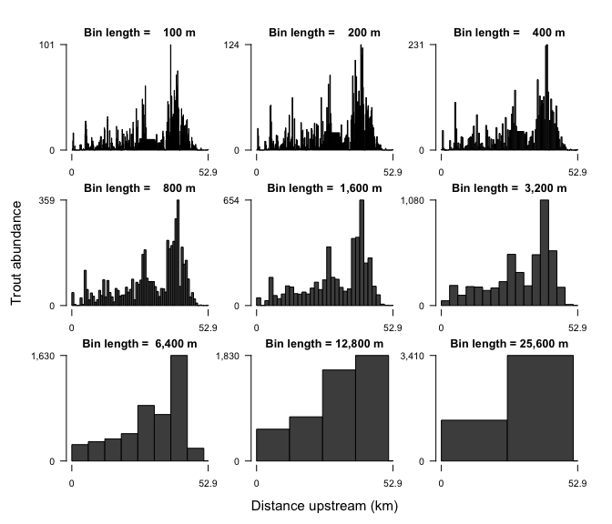

<!-- README.md is generated from README.Rmd. Please edit that file -->
linbin
======

Short for "linear binning", linbin is an [R](http://www.r-project.org/) package for manipulating, binning, and plotting linearly referenced data. Although developed for data collected on river networks, it can be used with any interval or point data referenced to a 1-dimensional coordinate system. Flexible bin generation and batch processing makes it easy to compute and visualize variables at multiple scales, useful for identifying patterns within and between variables and investigating the influence of scale of observation on data interpretation.

To install in R:

-   the latest released version: `install.packages("linbin")`
-   the latest development version: [devtools](https://github.com/hadley/devtools)::`install_github("ezwelty/linbin")`

Find out more by reading the illustrated [introduction](http://cran.r-project.org/web/packages/linbin/vignettes/introduction.html) and [examples](http://cran.r-project.org/web/packages/linbin/vignettes/examples.html) vignettes. For detailed function and dataset documentation, see the [reference manual](http://cran.r-project.org/web/packages/linbin/linbin.pdf). For the application of linbin to the study of stream fishes, see the original [journal article](http://www.tandfonline.com/doi/full/10.1080/02755947.2015.1044764):

*Ethan Z. Welty, Christian E. Torgersen, Samuel J. Brenkman, Jeffrey J. Duda, Jonathan B. Armstrong (2015). Multiscale analysis of river networks using the R package linbin. North American Journal of Fisheries Management, 35(4):802–809. doi: [10.1080/02755947.2015.1044764](http://doi.org/10.1080/02755947.2015.1044764)*

### ...

> *Longitudinal profiles of trout abundance throughout the Quinault River, Washington, USA plotted at a range of bin lengths.*
